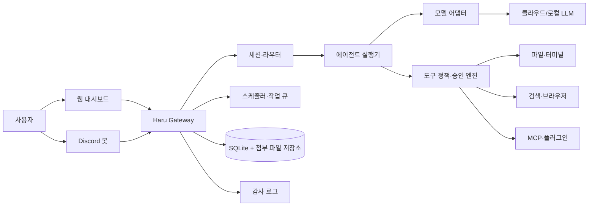

# 개인 AI 오케스트레이터 설계 v0.1

## 0. 제품 정의

**이름(임시): Haru** — Windows와 Linux에서 실행되며, 웹 대시보드와 Discord로 조작하는 개인용·로컬 우선 AI 오케스트레이터.

한 문장으로는 **"여러 AI 모델과 로컬 PC 도구를 안전한 승인 절차 아래 연결하고, 기억·자동화·전문 에이전트로 장기 작업을 이어가는 개인 작업 운영체제"**다.

### 핵심 원칙

1. **로컬 우선**: 대화, 기억, 작업 이력, 첨부 파일과 비밀키는 기본적으로 사용자의 PC 또는 개인 서버에 둔다.
2. **승인 우선**: 파일 삭제·덮어쓰기, 외부 전송, 브라우저의 제출/결제, 위험 명령은 원칙적으로 멈추고 사람이 승인한다.
3. **교체 가능성**: 모델·검색·브라우저·MCP·에이전트 런타임을 어댑터로 분리해 특정 벤더에 묶이지 않는다.
4. **관찰 가능성**: 모든 실행은 누가, 어떤 입력으로, 어떤 도구를, 왜 호출했는지 남기고 재현 가능한 실행 기록을 제공한다.
5. **작게 시작**: 완성형 OpenClaw 복제가 아니라, 매 단계에서 실제로 쓸 수 있는 제품을 만든다.

## 1. 사용자와 사용 흐름

### 주 사용자

- 단일 사용자(관리자) 1명. 다중 사용자/팀 협업은 범위 밖이다.
- 개인 PC에서 코딩, 자료 조사, 문서 처리, 반복 알림을 보조받는다.
- Discord는 원격에서 빠르게 명령을 내리는 입구이며, 민감한 승인과 상세 설정은 웹 대시보드에서 한다.

### 대표 흐름

1. 사용자가 웹 또는 Discord에서 요청하고 파일을 첨부한다.
2. 라우터가 대화 세션·프로젝트·에이전트·모델을 결정한다.
3. 모델은 필요한 도구 호출 계획을 만든다. 도구 정책이 권한과 승인 필요 여부를 판정한다.
4. 자동 승인 가능한 읽기 작업은 실행하고, 위험/파괴적 작업은 **승인 카드**로 중단한다.
5. 결과·인용·파일 변경점·감사 로그를 저장하고, 필요한 사실만 장기 기억 후보로 제안한다.

## 2. 출시 단계와 범위

### P0 — 안전한 개인 비서 (첫 번째 실제 사용 가능 버전)

- 웹 채팅, 모바일 반응형, Markdown, 스트리밍, 중지, 세션 관리·검색
- OpenAI API / Anthropic / Gemini / OpenAI 호환 API / Ollama 연결
- 파일 첨부: 텍스트, 코드, PDF, 이미지. 모델이 비전을 지원하지 않으면 PDF 텍스트 추출·이미지 OCR을 보조 경로로 사용
- 프로젝트 작업공간 안에서만 파일 읽기·생성·패치 수정·검색
- 명령 실행, 실행 로그, diff 미리보기, 명시적 승인
- 웹 검색/본문 읽기와 출처 표시
- Discord 단일 봇 채널, 발신자 허용 목록, 봇 루프 차단
- SQLite 기반 세션·감사 로그·간단한 장기 기억
- 비밀키 암호화 저장, 로컬 게이트웨이 토큰, 자동 백업 가능한 Git 저장소

**P0에서 의도적으로 제외**: 브라우저 로그인 자동화, 영상/음악 생성, 여러 하위 에이전트, 플러그인 마켓, 원격 공개 접속, 임의 MCP 자동 설치.

### P1 — 기억·자동화·브라우저

- 장기 기억 검토함, 편집/삭제, 임베딩 기반 검색, 세션 요약·컨텍스트 예산 관리
- 단발/반복 리마인더, Cron, 시간대, 실행 이력, 재시도, 결과 Discord 전송
- Heartbeat(점검 목록을 주기적으로 실행), 웹훅 수신, 중단 가능·재개 가능한 워크플로
- Playwright 기반 격리 브라우저: 열기, 읽기, 클릭, 입력, 캡처
- 로그인 브라우저 프로필은 별도 격리 프로필로만 지원하고, 제출·다운로드·외부 전송은 승인 필요
- 이미지 생성/편집, STT/TTS 공급자 어댑터

### P2 — 오케스트레이션과 확장

- 전문 에이전트 프로필, 프로젝트/Discord 라우팅, 격리 작업공간과 개별 도구 정책
- 하위 에이전트 위임·병렬 실행·대기·결과 취합·진행 상태
- 백그라운드 작업 큐와 목표 추적
- MCP 클라이언트, 스킬 패키지, 신뢰 확인을 거친 로컬/공식 플러그인
- ACP 어댑터를 통한 Codex·Claude Code 같은 외부 코딩 에이전트 연결
- 원격 접속(Tailscale 우선, SSH 터널 차선), TLS

### P3 — 고급 운영

- 플러그인 탐색/업데이트 화면, 커스텀 공급자·도구 SDK
- 이벤트 훅, 외부 서비스 연동, 자동 스킬 초안
- Canvas/동적 대시보드, 모바일 노드, 동영상·음악 생성
- 다중 장치 상태·복구·업데이트 채널 관리

## 3. 권장 기술 구성

| 영역 | 선택 | 이유 |
| --- | --- | --- |
| 런타임 | Node.js LTS + TypeScript | Windows/Linux 지원, AI·Discord·MCP 생태계, 타입 안전성 |
| 모노레포 | pnpm workspaces + Turborepo | 코어/웹/CLI/플러그인 SDK를 독립적으로 관리 |
| 게이트웨이 API | Fastify + WebSocket | 가벼운 로컬 서버와 실시간 스트리밍 |
| 웹 앱 | React + Vite + TanStack Router/Query | 로컬 배포가 단순하고 대시보드 UI에 적합 |
| 데이터 | SQLite(WAL) + Drizzle ORM + FTS5 | 설치 부담이 작고, 단일 사용자·백업에 적합 |
| 기억 검색 | sqlite-vec 또는 로컬 임베딩 어댑터 | 장기 기억 검색을 외부 벡터 DB 없이 처리 |
| 작업 큐/스케줄러 | SQLite 영속 큐 + 자체 워커 | 재시작 후에도 작업/리마인더/이력을 보존 |
| 파일 분석 | 추출기 어댑터(PDF/OCR/이미지) | 모델의 멀티모달 지원 여부와 분리 |
| 브라우저 | Playwright, 별도 사용자 데이터 디렉터리 | 재현성·격리·승인 경계를 확보 |
| Discord | discord.js | 공식 Gateway 이벤트와 상호작용 지원 |
| 비밀키 | OS 키체인 우선 + 암호화된 SQLite 보조 저장 | 소스·Git·로그에서 키를 분리 |
| 배포 | 단일 Node 서비스 + systemd/Windows Task Scheduler | Docker는 선택 사항으로 남김 |

OpenAI API 통합은 서버 측 API 키를 사용하고 키를 브라우저에 노출하지 않는다. 공식 문서도 API 키를 비밀로 보관하고 클라이언트 코드에 넣지 말 것을 안내한다. [OpenAI API 인증 문서](https://platform.openai.com/docs/api-reference/backward-compatibility?lang=ruby)  
**Codex 구독 OAuth**는 공개 API 키 방식과 별도 인증 경로이므로 P0의 필수 경로가 아니다. 공식적으로 안정된 외부 연동 계약이 확인되기 전까지는 "실험적 어댑터"로 격리하고, P0는 OpenAI API 키 기반 Responses API를 기준으로 구현한다. Responses API는 텍스트·이미지·PDF 입력과 도구 연결을 지원한다. [OpenAI Quickstart](https://platform.openai.com/docs/quickstart/make-your-first-api-request)

## 4. 시스템 구조



### 패키지 경계

```text
apps/
  gateway/       HTTP·WebSocket·Discord·스케줄러를 띄우는 단일 서비스
  dashboard/     React 웹 관리 화면
  cli/           설치, 상태, 진단, 백업, 관리 명령
packages/
  core/          도메인 모델, 이벤트, 공통 타입
  agent/         프롬프트 조립, 스트리밍, 도구 호출 루프
  providers/     OpenAI, Anthropic, Gemini, Ollama, 호환 API 어댑터
  tools/         파일, exec, 웹, 브라우저, 미디어 도구와 정책
  memory/        문맥 예산, 요약, 기억 추출/검색/검토
  automation/    cron, 작업 큐, 재시도, 워크플로
  security/      비밀키, 승인, 샌드박스, 감사
  integrations/  Discord, MCP, 이후 ACP/플러그인
  db/            Drizzle 스키마·마이그레이션
```

## 5. 에이전트 실행 모델

### 단일 실행(run)의 상태

`queued → planning → running → waiting_approval → running → succeeded | failed | cancelled | timed_out`

- 모든 모델 출력, 도구 호출, 승인, 파일 변경, 전달 메시지는 하나의 `run` 아래에 기록한다.
- 스트리밍은 이벤트로 웹과 Discord에 전달한다. Discord에는 빈번한 토큰 단위 편집이 아닌 문장/짧은 청크 단위로 갱신한다.
- 한 세션은 기본적으로 한 번에 하나의 변경 작업만 수행한다. 읽기 전용 하위 작업은 P2에서 병렬화한다.
- 모델이 "도구를 호출할 수 있음"과 실제 도구를 실행할 수 있음은 다르다. 정책 엔진이 최종 결정권자다.

### 컨텍스트 조립 순서

1. 시스템 안전 지침과 전역 사용자 지침
2. 에이전트·프로젝트 지침(`AGENTS.md` 등)
3. 현재 세션의 최근 메시지와 고정 요약
4. 요청과 관련된 승인된 장기 기억
5. 첨부 파일에서 추출한 필요한 부분
6. 현재 사용자 요청

토큰 예산을 넘으면 먼저 오래된 원문을 요약으로 치환한다. 기억 검색 결과는 작은 수로 제한하고, 기억마다 출처·생성일·신뢰도·사용자 승인 상태를 함께 보낸다.

## 6. 데이터 설계

| 엔터티 | 핵심 필드 | 목적 |
| --- | --- | --- |
| `projects` | id, name, workspace_path, policy_id | 파일 권한과 지침의 단위 |
| `agents` | id, role, system_prompt, model_policy, tool_policy | 전문 에이전트 정의 |
| `sessions` | id, project_id, agent_id, source, status, summary | 대화/작업 문맥 |
| `messages` | session_id, role, content, attachments, citations | 대화 기록 |
| `runs` | session_id, status, model, input_snapshot, timestamps | 한 번의 에이전트 실행 |
| `tool_calls` | run_id, tool, request, result, risk, approval_id | 도구 실행 기록 |
| `approvals` | action, preview, risk, expires_at, decision | 사람이 결정한 증거 |
| `memories` | text, kind, source, embedding, trust, user_state | 장기 기억 |
| `jobs` / `job_runs` | schedule, payload, retry, outcome | 알림·Cron·워크플로 |
| `credentials` | provider, key_ref, metadata | 키체인 참조만 보관 |
| `audit_events` | actor, event, resource, before, after | 변경 불가능한 감사 로그 |

첨부 원본은 DB Blob 대신 `data/attachments/<sha256>/`에 두고 DB에는 해시·경로·미리보기·추출 텍스트만 저장한다. 파일은 중복 제거하고, 민감 파일은 자동 장기 기억으로 승격하지 않는다.

## 7. 보안 설계: 제품의 중심 규칙

### 위험 등급

| 등급 | 예시 | 기본 처리 |
| --- | --- | --- |
| R0 읽기 | 파일 읽기, 웹 검색, 상태 조회 | 프로젝트 정책 안에서 자동 실행 |
| R1 가역 변경 | 새 파일 작성, 브라우저 입력(미제출), 로컬 임시 작업 | 실행 전 요약 표시, 정책에 따라 자동/승인 |
| R2 변경 | 기존 파일 수정, 프로세스 중지, Discord 발신, 다운로드 | 승인 카드 필요 |
| R3 파괴/외부 효과 | 삭제, 덮어쓰기, Git push, 폼 제출, 결제, 비밀 전송, 권한 변경 | 항상 명시적 승인 + 정확한 대상/미리보기 |

### 삭제 방지 계약

- `delete`, `remove`, `unlink`, 재귀 삭제, 휴지통 비우기, 데이터베이스 삭제, Git 강제 작업은 R3이다.
- 사용자가 **현재 요청에서 정확한 대상과 삭제 의도**를 명시하지 않으면 실행하지 않는다.
- 대상, 개수/크기, 되돌릴 수 있는 방법을 승인 카드에 표시한다.
- 가능한 경우 즉시 삭제 대신 프로젝트별 `.haru-trash/`로 이동하고, 복원 기한을 둔다.
- 모델 프롬프트의 지시는 정책 엔진을 우회할 수 없다.

### 추가 경계

- 모든 파일 경로를 실제 경로로 해석한 뒤 프로젝트 루트 내부인지 검증한다. 심볼릭 링크 탈출도 차단한다.
- 셸은 인자 배열로 실행하고, 작업 디렉터리를 프로젝트 루트로 고정한다.
- 비밀키를 프롬프트, 로그, 스크린샷, Git에 넣지 않도록 마스킹한다.
- Discord는 기본 거부, 허용된 사용자 ID만 수신, 봇 작성 메시지는 무시한다.
- 원격 공개 바인딩은 P2 전까지 금지한다. Tailscale/SSH를 공개 포트보다 우선한다.

## 8. 화면 설계

### P0 대시보드

1. **채팅**: 세션 목록, 메시지, 첨부, 모델 선택, 실행 상태, 출처, 취소 버튼.
2. **승인함**: 위험도·변경 전후 diff·명령·외부 목적지·만료 시각, 승인/거절.
3. **프로젝트**: 작업공간 지정, 지침 파일, 접근 권한, 최근 변경.
4. **기억**: 검색, 출처 열람, 승인/수정/삭제, 자동 추출 검토.
5. **연결**: 모델 키, Ollama URL, Discord 봇 상태. 키 값은 재표시하지 않는다.
6. **실행 기록**: 세션/작업별 모델, 시간, 도구, 비용 추정, 오류, 감사 로그.

## 9. Git 백업 전략

- 이 작업공간은 Git으로 초기화하며, 소스·문서·테스트·안전한 예제 설정만 커밋한다.
- `.env`, 키, 첨부 파일, SQLite DB, 로그, 런타임 상태는 `.gitignore`로 제외한다.
- 데이터 백업은 별도 암호화 아카이브 또는 SQLite online backup으로 만들며, **Git에 저장하지 않는다**.
- 작업 단위마다 작고 설명적인 커밋을 남긴다. 예: `docs: add initial architecture`.
- GitHub 원격은 **비공개 저장소**만 사용한다. 현재 환경에는 GitHub CLI가 없으므로, 원격 생성은 GitHub Desktop 또는 사용자의 `git remote add` 후 연결한다.
- `git push`는 외부 전송(R3)이라 첫 설정과 매 원격 변경은 승인 절차로 취급한다.

## 10. 구현 순서

1. 모노레포 골격, 환경 설정, `.gitignore`, CI의 비밀 검사
2. Gateway + SQLite 마이그레이션 + 로컬 토큰 인증 + 상태 화면
3. 웹 채팅, 세션, SSE/WebSocket 스트리밍, OpenAI 호환 모델 어댑터
4. 프로젝트 경계 파일 도구 + diff + 승인함 + 감사 로그
5. Ollama/Anthropic/Gemini 어댑터와 PDF/이미지 처리
6. Discord + 허용 목록 + 봇 루프 차단
7. 검색·본문 읽기 + 출처 UI
8. 기억·요약·검색·검토함
9. Cron/리마인더/작업 큐
10. 브라우저, 워크플로, 하위 에이전트, MCP 순으로 확장

## 11. P0 완료 기준

- Windows와 Linux에서 `haru start`로 Gateway와 대시보드가 실행된다.
- 사용자는 새 프로젝트 폴더를 지정하고, 파일·PDF·이미지를 첨부해 대화할 수 있다.
- OpenAI 호환 API와 Ollama 중 하나 이상으로 스트리밍 대화가 가능하며 모델을 교체할 수 있다.
- 에이전트는 프로젝트 내부에서만 읽기/생성/패치 변경을 수행한다.
- 기존 파일 수정, 모든 삭제, 위험 명령은 대시보드 승인 없이는 실행되지 않는다.
- 승인 기록, 도구 호출, 파일 diff, 오류가 실행 기록에 남는다.
- 허용된 Discord 사용자만 봇에 요청할 수 있고, 봇 메시지에는 응답하지 않는다.
- Git 상태가 깨끗하고, 비밀키·DB·첨부 파일이 추적되지 않는다.

## 12. 지금 결정한 사항과 나중에 결정할 사항

### 지금 고정

- 단일 사용자, Windows/Linux, 웹 대시보드 + Discord
- TypeScript/Node/SQLite 기반의 로컬 게이트웨이
- 승인 엔진을 모델/도구보다 상위에 둠
- P0은 API 키 기반 모델 연결을 기준으로 함

### 실제 구현 전 사용자 선택이 필요한 것

- 제품 이름과 GitHub 비공개 저장소 이름
- 기본 모델 제공자와 월 예산
- 기본 작업공간 경로 및 샌드박스 방식(Docker/컨테이너 사용 가능 여부)
- Discord 봇 애플리케이션 생성 및 토큰 제공 시점
- 원격 접속을 언제 열지(Tailscale 권장)
